# Reservoir and Basin Analysis

This plugin can help the user create a pre-project for a reservoir,
whether to contain water in flood events or to generate energy, for example.

## Technologies

The following technologies were used in processing the algorithms of this plugin:  
QGIS  
GDAL  
SAGA Next Generation  
Numpy  
Scipy  
Plotly  

## Installation

With QGIS open, follow these steps: plugins -> manage and install plugins -> install from ZIP
Then select the ZIP containing this plugin -> install plugin  
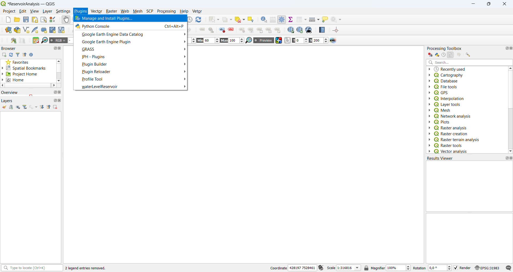
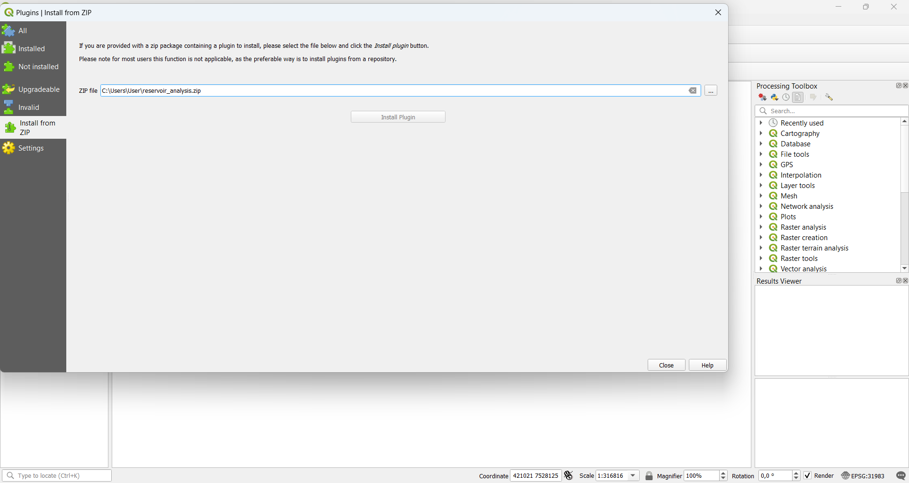    
or place this plugin in the folder corresponding to plugins installed in QGIS,
normally found in the path:   C:\Users\User\AppData\Roaming\QGIS\QGIS3\profiles\default\python\plugins\

## Tools
This plugin offers 3 tools to help with the study of a reservoir, are they:  
Create a drainage area - this tools create a vectorized drainage area from a DEM and a outlet point  
Create a flooded area - this tool create a vectorized flooded area from a DEM and a drainage area/outlet point  
Create a graph - this tool create a graph which relates the three main parameters for the study of a reservoir drainage area, the flooded area,
the height of the water depth and the volume of water contained,
this tool can be used prior to the flooded area creation tool, to better decision making

## Recommendations
If there is no previously defined outlet point, it is recommended to create channels with the DEM to be used in the plugin, so that the outlet point is more easily located.  
All layers must be in a CRS that uses meters as the unit of measurement.

## Examples
You want to study a dam, located in the south of Minas Gerais, in the city of Itajubá,
which blocks a flow event with a return period of XXXX years and which occurred over X days,
assuming that the total water volume is 100000000 m3,
you first extract the drainage area with the outlet point indicated at the dam location,
then you create the flooded area with the indicated volume and from the generated attribute table
you check the height of the water depth for the flooded area with the given volume and you can use this water depth height to calculate the dam dimensions.  
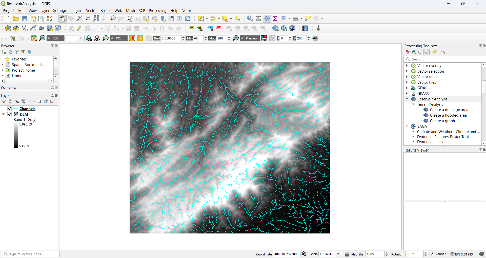
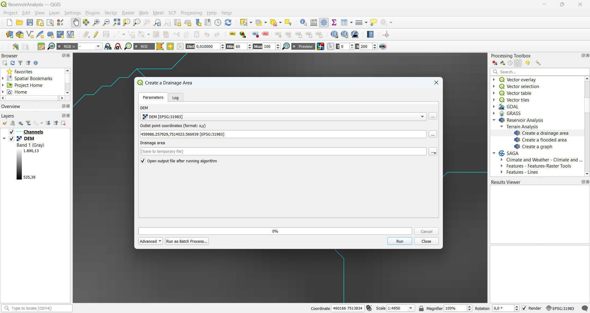
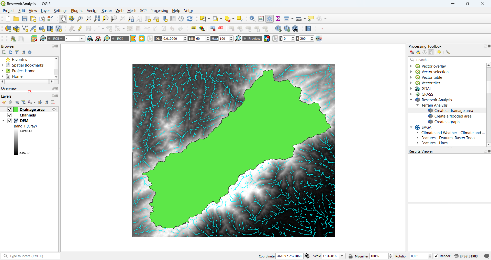
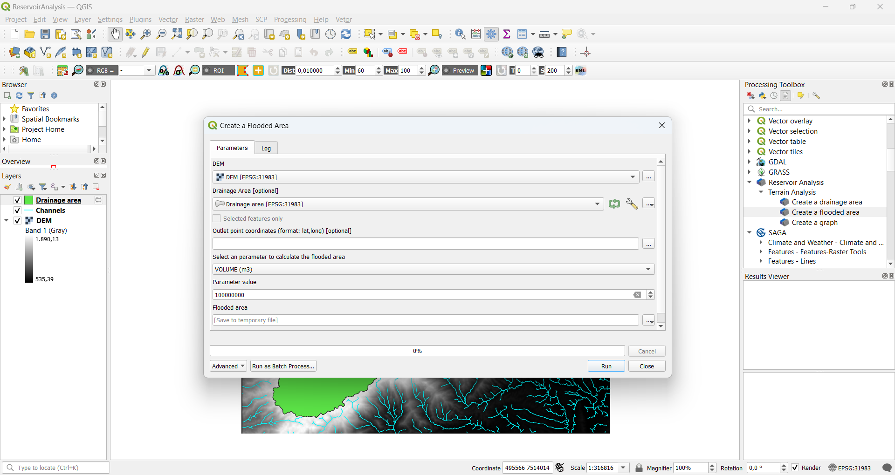
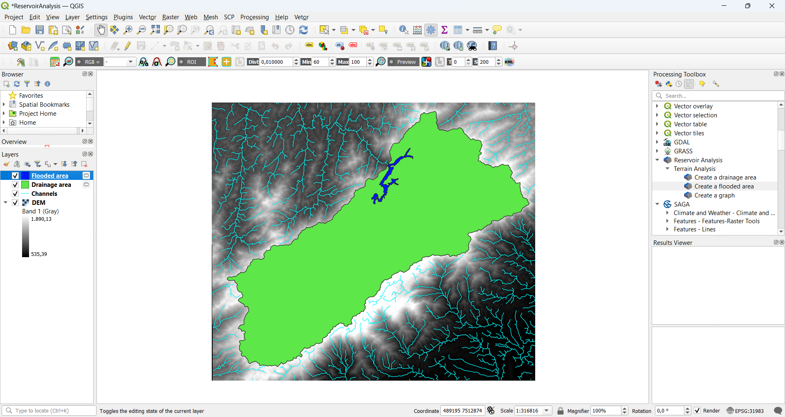
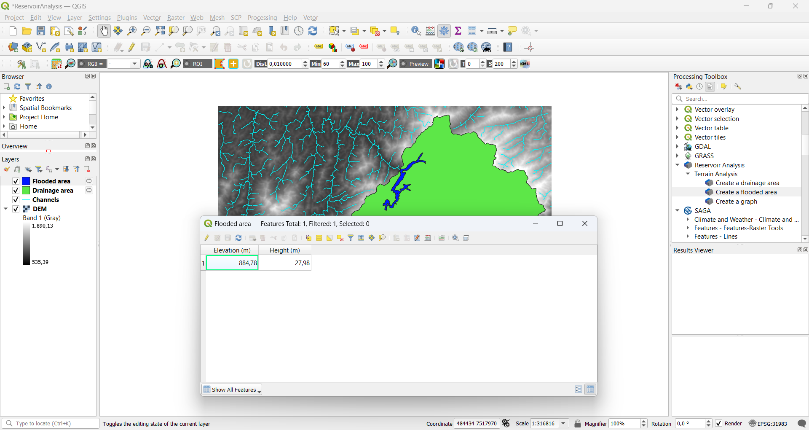
Another example, you want to study a reservoir caused by a small hydroelectric plant,
you want it to generate as much energy as possible,
but flooding the smallest possible area and you need to find a middle ground,
so first you generate the Area x Height x Volume graph,
and see a good relation between the variables you can use, in this case, 1660 meters,
then you extract the height corresponding to that point and generate
the flooded area in the drainage basin with the height found on the graph.  

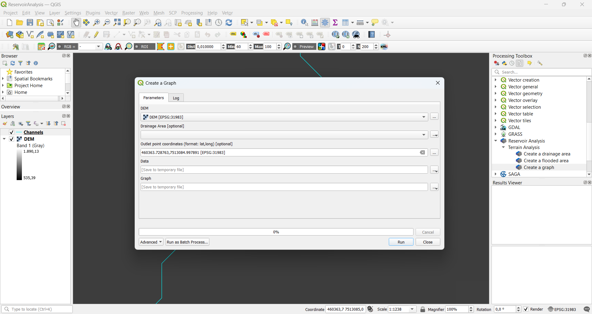
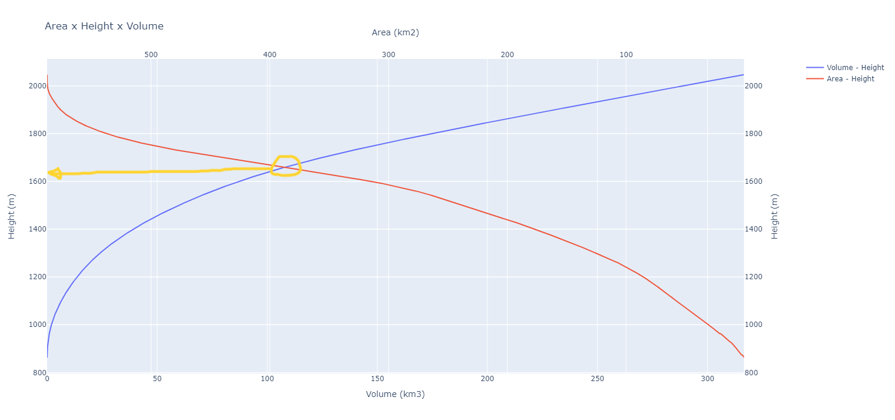
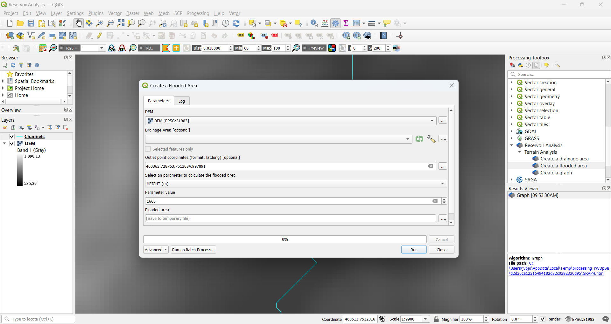
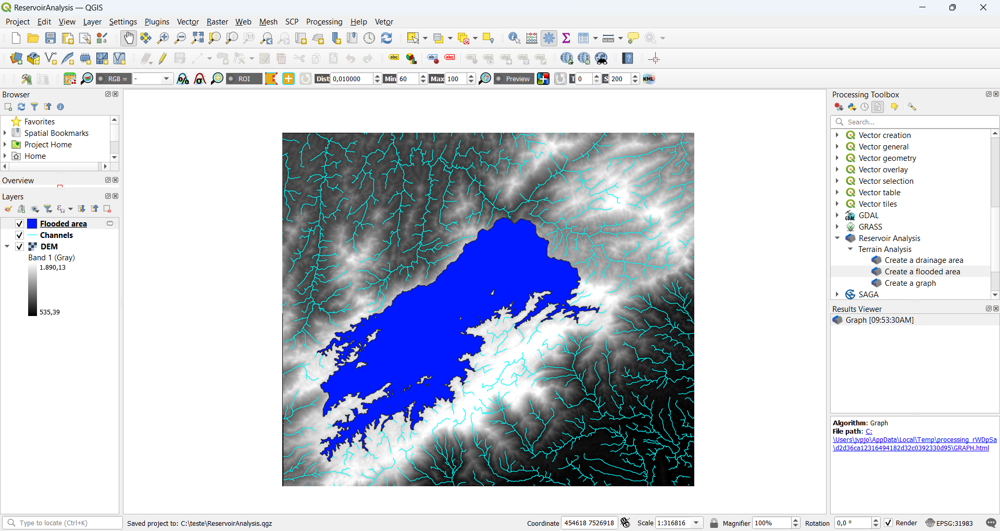
## Acknowledgment

Special thanks to the authors of all the technologies used in this plugin and who made it possible,
to my parents and friends, to my teachers, and to the giants who, by standing on their shoulders,
allowed me to see further.

## Contributing

This software readily accepts modifications and optimizations, as long as they make sense for proper functioning and user comfort.

## License

[GNU General Public License, version 2](https://www.gnu.org/licenses/old-licenses/gpl-2.0.html.en)